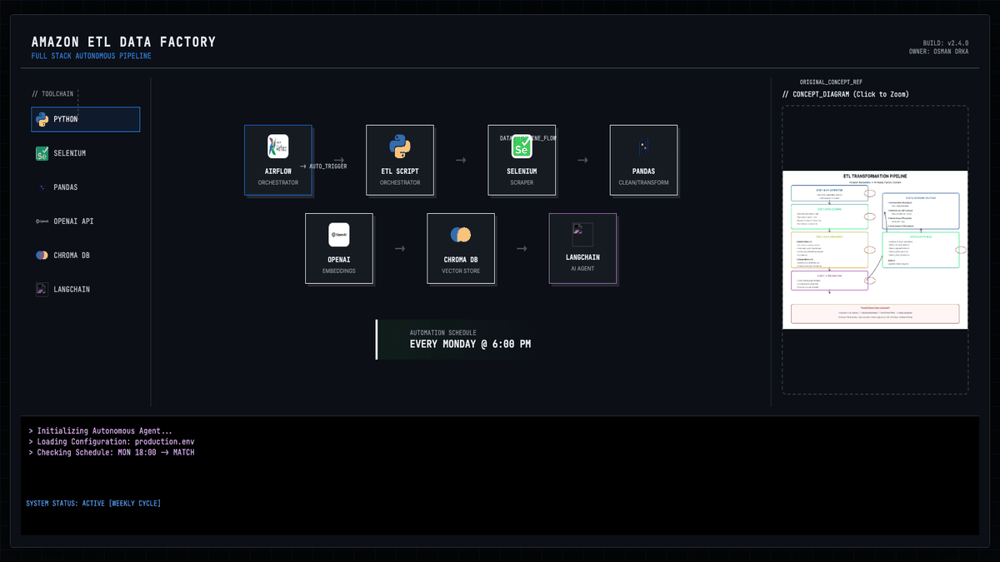

# 🤖 Chatbot Warehouse Assistant



## 🎯 Objective

Build an intelligent warehouse assistant that can answer natural language questions about product inventory, stock levels, and warehouse operations using RAG (Retrieval-Augmented Generation) and LangChain.

## 📦 What

- **AI-Powered Chatbot**: Natural language interface for warehouse queries
- **RAG Architecture**: ChromaDB vector store + GPT-4o for accurate, context-aware responses
- **Multi-Warehouse Support**: Query stock across Sydney, Melbourne, Brisbane, Perth locations
- **Real-Time Updates**: Flask + Socket.IO for live chat experience
- **Voice Integration**: Speech-to-text and text-to-speech capabilities

## 🤔 Why

Manual inventory lookups are slow and error-prone. This assistant enables:
- Instant answers to stock queries ("How many electronics in Sydney?")
- Smart recommendations ("Best warehouse for books if Brisbane is full")
- What-if simulations ("If I move 50 items from Melbourne...")
- Cross-warehouse comparisons in natural language

## 🚀 How

```bash
# 1. Clone & install
git clone https://github.com/ozzy2438/Chatbot-Warehouse-Assistant-Langchain-.git
cd Chatbot-Warehouse-Assistant-Langchain-

# 2. Set up environment
python -m venv venv && source venv/bin/activate
pip install -r requirements.txt

# 3. Configure API key
echo 'OPENAI_API_KEY=your-key-here' > .env

# 4. Run chatbot
python chatbot.py          # CLI mode
python app.py              # Web interface (localhost:5000)
```

---

**Tech Stack**: Python • LangChain • OpenAI GPT-4o • ChromaDB • Flask • Socket.IO
