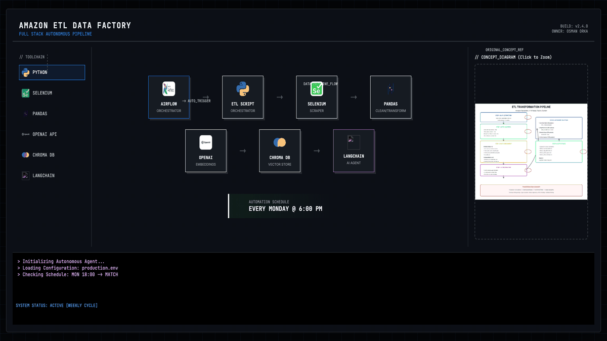

# 🏭 AI-Powered Warehouse Operations Assistant

<div align="center">


*An end-to-end intelligent inventory management system — from Amazon data ingestion to voice-enabled natural language queries across Australian distribution centres.*



</div>

---

## 📋 Table of Contents

- [Executive Summary](#-executive-summary)
- [The Problem](#-the-problem-it-solves)
- [Solution & Architecture](#-solution--architecture)
- [Technology Stack](#-technology-stack)
- [Key Features](#-key-features)
- [ETL Pipeline](#-etl-pipeline--data-engineering)
- [RAG & LangChain Architecture](#-rag--langchain-architecture)
- [Interfaces & Deployment Modes](#-interfaces--deployment-modes)
- [Project Structure](#-project-structure)
- [Getting Started](#-getting-started)
- [Sample Queries](#-sample-queries)
- [Business Impact & Market Value](#-business-impact--market-value)

---

## 🎯 Executive Summary

This project is a **production-grade, AI-powered warehouse operations assistant** that combines advanced data engineering with modern conversational AI. It automatically harvests real product data from Amazon bestseller listings, processes it through a fully automated ETL pipeline, and exposes that data through a natural language interface — enabling warehouse managers and operations teams to ask plain-English questions about stock, inventory health, and supply chain logistics.

The system operates across four Australian distribution centres (Sydney, Melbourne, Brisbane, Perth) and supports text, web, and voice interaction modes. It was built to demonstrate the full lifecycle of an applied AI product: raw data acquisition → transformation → vector indexing → intelligent retrieval → conversational delivery.

> **Bottom line:** A user can say *"Which warehouse has the most electronics stock, and what would happen if I transferred 100 units to Perth?"* — and receive an accurate, context-aware answer in under two seconds.

---

## 🔍 The Problem It Solves

### The Industry Pain Point

Modern warehousing generates enormous volumes of inventory data, yet the tools used to query that data remain largely static: spreadsheets, ERP dashboard exports, and manual SQL queries. This creates a significant operational bottleneck:

| Challenge | Traditional Approach | This Solution |
|---|---|---|
| Stock level queries | Log into ERP, navigate menus, export report | Ask in plain English, get instant answer |
| Cross-warehouse comparison | Open multiple tabs, manually compare | Single natural language query |
| What-if scenario modelling | Manual spreadsheet recalculation | Real-time simulation with validation |
| Low stock identification | Scheduled reports, often stale | Always-on, query-driven alerts |
| Accessibility for non-technical staff | Requires ERP training | Zero training overhead |
| Voice-driven operations | Not supported | Full Whisper + TTS integration |

### Who This Is Built For

- **Operations Managers** who need instant, cross-facility stock visibility
- **Procurement Teams** running replenishment decisions on live data
- **Warehouse Staff** who need hands-free, voice-enabled inventory lookups
- **Business Analysts** modelling inventory redistribution scenarios
- **Supply Chain Engineers** evaluating AI-first warehouse tooling

---

## 🏗️ Solution & Architecture

### System Overview

```
┌─────────────────────────────────────────────────────────────────┐
│                      DATA INGESTION LAYER                       │
│                                                                 │
│  Amazon Bestsellers  ──►  Selenium Scraper  ──►  Raw JSON/CSV   │
│  (12 categories,          (2,000 products,       (ASIN, price,  │
│   stealth mode)            rate-limited)          ratings, etc) │
└────────────────────────────────┬────────────────────────────────┘
                                 │  Apache Airflow DAG (daily 2AM)
┌────────────────────────────────▼────────────────────────────────┐
│                       ETL PIPELINE LAYER                        │
│                                                                 │
│  Extract ──► Transform ──► Load ──► Archive ──► Alert           │
│  (scrape)   (enrich,       (vector  (auto       (email          │
│              clean,         store)   manage)     SMTP)          │
│              simulate                                           │
│              inventory)                                         │
└────────────────────────────────┬────────────────────────────────┘
                                 │
┌────────────────────────────────▼────────────────────────────────┐
│                     AI & RETRIEVAL LAYER                        │
│                                                                 │
│  ChromaDB Vector Store  ◄──  text-embedding-3-small             │
│  (1,200+ products,            (OpenAI Embeddings API)           │
│   persistent, k=10)                                             │
│           │                                                     │
│           ▼                                                      │
│  LangChain Intent Router                                        │
│    ├── recommendation  ──► Smart warehouse selector             │
│    ├── simulation      ──► DataFrame transfer calculator        │
│    ├── count/filter    ──► Pandas analytics engine              │
│    ├── product_query   ──► RAG retrieval chain                  │
│    └── unknown         ──► GPT-4o-mini fallback                 │
└────────────────────────────────┬────────────────────────────────┘
                                 │
┌────────────────────────────────▼────────────────────────────────┐
│                      INTERFACE LAYER                            │
│                                                                 │
│  CLI (Rich UI)  │  Flask + Socket.IO  │  Voice (Whisper + TTS)  │
│                 │  (real-time web)    │  (push-to-talk /        │
│                 │                    │   continuous listen)     │
└─────────────────────────────────────────────────────────────────┘
```

### Query Routing Logic

Every user message passes through a multi-stage intelligent router before any LLM call is made:

```
User Input
    │
    ├─ Regex: Transfer/move keywords?
    │       └─► Parse transfer → simulate DataFrame operation → validate stock
    │
    ├─ LLM Intent Extraction (gpt-4o-mini, structured JSON output)
    │       Extracts: intent | locations | category | operation | filters
    │
    ├─ Intent == "recommendation"?
    │       └─► Query all warehouses → rank by stock → return top 3 with counts
    │
    ├─ Intent == "simulation"?
    │       └─► Multi-step transfer calculation with live validation & warnings
    │
    ├─ Intent == "count" / "comparison"?
    │       └─► Pandas DataFrame query with filters (location, category, price, rating)
    │
    └─ Intent == "product_query" / "unknown"
            └─► ChromaDB similarity search (k=10) → RAG chain → GPT-4o-mini
```

---

## 🛠️ Technology Stack

### Core AI & NLP

| Technology | Version / Model | Role |
|---|---|---|
| **LangChain** | Latest | RAG orchestration, chains, intent extraction, prompt management |
| **OpenAI GPT-4o-mini** | `gpt-4o-mini` | LLM for reasoning, intent extraction, RAG responses |
| **OpenAI Embeddings** | `text-embedding-3-small` | Product document vectorisation |
| **OpenAI Whisper** | `whisper-1` | Speech-to-text (EN/TR bilingual) |
| **OpenAI TTS** | `tts-1` | Text-to-speech response playback |
| **OpenAI Realtime API** | `gpt-4o-audio` | Low-latency streaming voice interface |
| **ChromaDB** | Local persistent | Vector store for semantic product retrieval |

### Data Engineering & ETL

| Technology | Role |
|---|---|
| **Apache Airflow** | DAG-based pipeline orchestration (daily 2 AM UTC) |
| **Selenium + ChromeDriver** | Stealth Amazon bestseller scraping (CDP anti-detection) |
| **Pandas** | Data transformation, inventory simulation, query analytics |
| **YAML Config** | Fully declarative ETL configuration (`etl_config.yaml`) |
| **SMTP (Gmail TLS)** | Pipeline success/failure email alerting |

### Web & Real-Time Interface

| Technology | Role |
|---|---|
| **Flask** | REST API server (`/api/ask`, `/api/health`, `/api/stats`) |
| **Socket.IO** | Bidirectional real-time WebSocket communication |
| **JavaScript (Browser)** | Web Speech API, Canvas audio visualiser, Markdown rendering |
| **marked.js** | Client-side Markdown-to-HTML rendering for responses |

### Infrastructure & Developer Experience

| Technology | Role |
|---|---|
| **Python 3.10+** | Primary language |
| **Rich** | Beautiful CLI output with tables, panels, spinners |
| **sounddevice / soundfile** | Low-level audio capture (16kHz, mono WAV) |
| **python-dotenv** | Environment variable management |
| **Rotating File Handler** | Production-grade logging with archival |

---

## ✨ Key Features

### 1. 🔄 Fully Automated Data Pipeline
Scrapes 2,000 Amazon bestseller products across 12 categories on a scheduled Airflow DAG. Includes stealth mode (randomised delays, human-like scrolling, CDP bot suppression), data enrichment, inventory simulation, and automatic ChromaDB reloading — zero manual intervention required.

### 2. 🧠 Hybrid AI Query Engine
Combines fast deterministic Pandas operations for numerical queries with LangChain RAG for semantic reasoning. Intent routing ensures the right engine handles each query, minimising LLM latency and cost while maximising accuracy.

### 3. 📦 Real-Time Inventory Simulation
Users can run `what-if` scenarios — *"What if I move 200 units from Melbourne to Sydney?"* — and receive validated before/after stock levels with low-stock warnings, all computed directly on the live DataFrame.

### 4. 🗣️ Multi-Modal Voice Interface
Three voice interaction modes: push-to-talk CLI, continuous listening with silence detection, and a low-latency OpenAI Realtime API streaming mode. Custom Whisper domain prompt improves recognition of warehouse terminology and location names.

### 5. 🌐 Modern Real-Time Web UI
Dark-themed, responsive chat interface with WebSocket streaming, audio waveform visualisation, Markdown rendering, and toggleable auto-speak mode. Supports both REST and Socket.IO transports.

### 6. 🔁 Conversational Memory
Maintains session-level filter context (location, category, price range, rating threshold, stock level) so follow-up questions like *"Show me the cheapest one"* resolve correctly without re-stating previous constraints.

### 7. 🌍 Bilingual Support (EN / TR)
NLP normalisation layer handles Turkish phonetic variations and query patterns alongside English, including 40+ location/category aliases (e.g. `"pört"` → `Perth`).

### 8. 🔔 Smart Alerting & Archival
Automatic low-stock threshold detection, SMTP pipeline alerting, and a tiered file archival system (7-day hot, 30-day cold) to manage storage efficiently.

---

## ⚙️ ETL Pipeline & Data Engineering

The data backbone of this system is a **5-stage automated ETL pipeline** managed by Apache Airflow:

```
Stage 1 — EXTRACT
└─ Selenium scraper targets 12 Amazon categories
   Captures: ASIN, product name, price (USD), star rating,
   review count, Prime eligibility, product URL, image URL
   Anti-detection: CDP stealth, 3–10s jitter, headless Chrome

Stage 2 — TRANSFORM
└─ Data cleaning: type casting, null handling, deduplication by ASIN
   Inventory simulation:
     • Stock levels: 50–500 units per product
     • Round-robin distribution across 4 warehouses
     • Restock dates, minimum thresholds, supplier lead times
     • Daily sales rates (1–50 units)
   Recommendation enrichment:
     • Similar-price alternatives (±30% variance)
     • Higher-rated alternatives (≥0.3 star delta)

Stage 3 — LOAD
└─ Rebuild ChromaDB collection with updated embeddings
   text-embedding-3-small, 1000-char chunks, 100-char overlap
   Each product → searchable document with all 21 fields

Stage 4 — ARCHIVE
└─ Auto-archive raw files >7 days old
   Purge archives after 30 days

Stage 5 — ALERT
└─ Email summary report on success/failure via Gmail SMTP TLS
```

**Output datasets:**

| File | Contents |
|---|---|
| `final_product_database.csv` | Master dataset — 1,200 products × 21 fields |
| `products_for_ai.csv` | AI-ready descriptions for RAG ingestion |
| `products_with_alternatives.csv` | ASIN-linked recommendation graph |
| `dashboard_summary.csv` | Executive-level KPI metrics |

---

## 🤖 RAG & LangChain Architecture

### Vector Store Design

Each product is embedded as a structured natural-language document:

```
Product: Apple AirPods 4
ASIN: B0DGJ7HYG1
Category: Electronics
Price: $99.99
Rating: 4.7/5 stars (45,000 reviews)
Stock: 234 units in Sydney warehouse
Satisfaction: Excellent
Minimum Stock Threshold: 50
Restock Date: 2025-01-15
Similar Price Alternatives: B0DGJ7HYG2 | B0DGJ7HYG3
Higher Rated Alternatives: B0DGJ7HYG4
```

This format ensures both semantic similarity search and structured field lookups produce reliable results.

### LangChain Components

- **`RetrievalQA` chain** — Core RAG pipeline: retriever → context injection → LLM answer
- **Custom intent extraction chain** — Structured JSON output with 6 intent classes
- **Prompt engineering** — Business-intelligence system prompt with domain rules (stock recommendations, transfer protocols, alert thresholds)
- **Retriever** — ChromaDB similarity search, `k=10` documents per query
- **Memory layer** — In-session filter state for multi-turn conversations

### Model Configuration

```python
LLM:        gpt-4o-mini   (temperature=0.1 for factual consistency)
Embeddings: text-embedding-3-small
Retriever:  ChromaDB similarity, k=10
Chunking:   RecursiveCharacterTextSplitter(chunk_size=1000, overlap=100)
```

---

## 🖥️ Interfaces & Deployment Modes

| Mode | Command | Description |
|---|---|---|
| **Interactive CLI** | `python chatbot.py` | Rich-formatted terminal chat |
| **Web Interface** | `python app.py` | Flask + Socket.IO on port 5001 |
| **Voice CLI** | `python voice_chatbot.py` | Push-to-talk with Whisper STT |
| **Continuous Voice** | `python voice_assistant.py` | Always-on, silence-triggered |
| **Realtime Streaming** | `python app_realtime.py` | GPT-4o Realtime API, PCM audio |
| **Airflow ETL** | `airflow standalone` | Scheduled daily pipeline at 2 AM |
| **ETL Manual Run** | `python etl_orchestrator.py` | Full 2,000-product pipeline |
| **ETL Test Mode** | `python etl_orchestrator.py --test` | Fast 200-product dry-run |
| **Rebuild Vector DB** | `python chatbot.py --rebuild` | Re-embed all products |

### API Endpoints (Flask)

| Method | Endpoint | Description |
|---|---|---|
| `GET` | `/` | Web chat interface |
| `POST` | `/api/ask` | REST text query |
| `GET` | `/api/health` | System health check |
| `GET` | `/api/stats` | Category & warehouse statistics |
| `WS` | `ask_question` | Real-time Socket.IO chat |

---

## 📁 Project Structure

```
.
├── chatbot.py                  # Core RAG engine & intent router (1,737 lines)
├── app.py                      # Flask + Socket.IO web server
├── app_realtime.py             # OpenAI Realtime API streaming server
├── voice_chatbot.py            # Push-to-talk voice CLI
├── voice_assistant.py          # Continuous voice detection mode
├── etl_orchestrator.py         # 5-stage ETL pipeline orchestrator
├── scrape_bestsellers_2000.py  # Selenium Amazon scraper with stealth mode
├── etl_config.yaml             # Declarative pipeline configuration
├── data_schema.txt             # 21-field product schema documentation
├── amazon_bestsellers_2000.json# Raw scraped dataset (~2,000 products)
│
├── data/
│   ├── products_for_ai.csv         # AI-ready product documents
│   ├── products_with_alternatives.csv
│   └── final_product_database.csv  # Master enriched dataset
│
├── airflow_dags/
│   ├── amazon_etl_pipeline.py      # Primary Airflow DAG
│   └── product_chatbot_pipeline.py # Alternative DAG config
│
├── chroma_db/                  # Persisted ChromaDB vector store
│
├── templates/
│   ├── index.html              # Main chat UI
│   └── index_realtime.html     # Advanced realtime UI (653 lines)
│
└── static/
    ├── css/style.css           # Dark theme stylesheet
    └── js/app.js               # WebSocket client & audio visualiser
```

---

## 🚀 Getting Started

### Prerequisites

- Python 3.10+
- OpenAI API key
- Google Chrome (for Selenium scraper)
- Apache Airflow (optional, for scheduled ETL)

### Installation

```bash
# 1. Clone the repository
git clone https://github.com/ozzy2438/Chatbot-Warehouse-Assistant-Langchain-.git
cd Chatbot-Warehouse-Assistant-Langchain-

# 2. Create and activate virtual environment
python -m venv venv
source venv/bin/activate          # macOS/Linux
venv\Scripts\activate             # Windows

# 3. Install dependencies
pip install -r requirements.txt

# 4. Configure environment
cp .env.example .env
# Edit .env and add your OpenAI API key:
# OPENAI_API_KEY=sk-...

# 5. Run the ETL pipeline to populate the database
python etl_orchestrator.py --test     # Quick test (200 products)
python etl_orchestrator.py            # Full run (2,000 products)

# 6. Launch your preferred interface
python chatbot.py                     # CLI mode
python app.py                         # Web interface → http://localhost:5001
python voice_chatbot.py               # Voice mode
```

### Airflow Setup (Optional)

```bash
# Initialise Airflow database
airflow db init

# Copy DAGs
cp airflow_dags/*.py ~/airflow/dags/

# Start scheduler and web server
airflow standalone                    # Dashboard → http://localhost:8080
```

---

## 💬 Sample Queries

```
📦 Stock Queries
"How many electronics do we have in Sydney?"
"List all products in Melbourne with stock below 50 units"
"What's the total inventory value across all warehouses?"

🏭 Warehouse Intelligence
"Which warehouse should I use if Brisbane runs out of books?"
"Compare stock levels for Home & Kitchen across all locations"
"Which city has the most available capacity right now?"

🔄 Simulation & Planning
"If I move 100 Electronics from Melbourne to Perth, what happens to stock levels?"
"Simulate transferring 50 units of Books from Sydney to Brisbane"
"What's the impact of a 200-unit transfer from Perth to Melbourne?"

🛍️ Product Queries
"Find the highest-rated products under $50 in Sydney"
"Show me alternatives to AirPods within a similar price range"
"Which Electronics have a rating above 4.5 and stock above 100?"

⚠️ Operational Alerts
"Which products are below minimum stock threshold in any warehouse?"
"Show me items that need urgent restocking in Melbourne"
```

---

## 📈 Business Impact & Market Value

### Quantifiable Operational Gains

| Metric | Before | With This System |
|---|---|---|
| Time to answer stock query | 5–15 minutes (ERP navigation) | < 2 seconds |
| Cross-warehouse comparison | 20–30 minutes manual | Single query |
| Scenario modelling | Hours (spreadsheet work) | Real-time simulation |
| Staff training required | ERP certification | None — plain English |
| Data freshness | Daily/weekly export | Automated nightly refresh |

### Why This Matters in 2025

The global **Warehouse Management System (WMS) market** is projected to reach **$8.6 billion by 2027** (CAGR 16.7%). The dominant trend driving this growth is conversational AI and natural language interfaces replacing traditional dashboard-based systems.

This project sits precisely at that intersection:

- **RAG over enterprise data** is the fastest-growing LLM deployment pattern in supply chain and logistics
- **Voice-enabled operations** reduce cognitive load for floor staff and enable hands-free querying
- **Automated data pipelines** (scraping → transformation → AI ingestion) demonstrate the full MLOps loop, not just a chatbot wrapper
- **Multi-modal interfaces** (CLI, Web, Voice, Streaming) show production readiness across different operator contexts

### Technical Differentiators

1. **Not a chatbot wrapper** — Implements a full data engineering pipeline (Airflow, ETL, scraping) powering the AI layer
2. **Hybrid reasoning** — Combines deterministic Pandas operations with probabilistic LLM reasoning, choosing the right tool per query type
3. **Real-world data** — Grounded in live Amazon bestseller data, not sample/fake datasets
4. **Production-oriented design** — Configuration-driven, logged, alerting-enabled, with vector DB persistence and automatic archival
5. **Bilingual NLP** — Handles mixed-language queries with phonetic normalisation, reflecting real-world multilingual warehouse environments

---

## 🗺️ Future Roadmap

- [ ] **Real-time inventory webhooks** — Push stock change events to connected ERP systems
- [ ] **Demand forecasting module** — ARIMA/Prophet integration for replenishment prediction
- [ ] **Multi-tenant architecture** — Isolated namespaces per warehouse region
- [ ] **Supplier API integrations** — Live lead time and pricing feeds
- [ ] **Mobile PWA** — Offline-capable progressive web app for floor staff
- [ ] **Analytics dashboard** — Executive KPI visualisation layer (Streamlit / Grafana)

---

## 🧑‍💻 Author

Built with a focus on demonstrating end-to-end AI product engineering — spanning data acquisition, pipeline automation, vector search, conversational AI, and multi-modal interfaces.

**Tech Stack Summary:** Python · LangChain · OpenAI GPT-4o · ChromaDB · Apache Airflow · Selenium · Flask · Socket.IO · Whisper · Pandas

---

<div align="center">

*If this project is relevant to a role you're hiring for, I'd welcome the opportunity to walk through the architecture in detail.*

</div>
